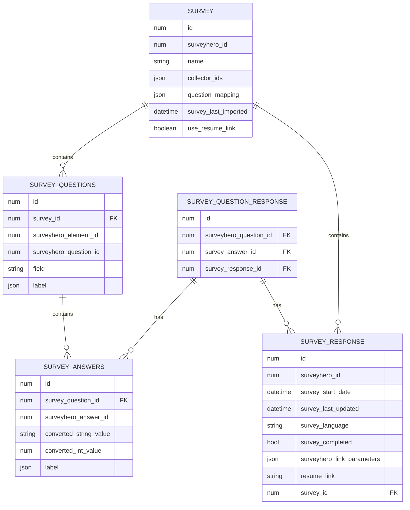

<p style="text-align: center;"></p>

# Import Surveyhero responses into the Laravel database

[](https://packagist.org/packages/statikbe/laravel-surveyhero)
[](https://github.com/statikbe/laravel-surveyhero/actions?query=workflow%3Arun-tests+branch%3Amain)
[](https://github.com/statikbe/laravel-surveyhero/actions?query=workflow%3A"Fix+PHP+code+style+issues"+branch%3Amain)
[](https://packagist.org/packages/statikbe/laravel-surveyhero)

This package allows you to import [Surveyhero](https://www.surveyhero.com) survey responses. 

## Installation

You can install the package via composer:

```bash
composer require statikbe/laravel-surveyhero
```

Please publish the config file with:

```bash
php artisan vendor:publish --tag="surveyhero-config"
```

Check the [configuration options](#configuration) first, in case you want to customise your data model.

Please publish and run the migrations with:

```bash
php artisan vendor:publish --tag="surveyhero-migrations"
php artisan migrate
```

**NB:** If you want to customise the default data model, first edit the configuration file, see the 
[Data Model Customisation section](#data-model-customisation).

## Upgrading to V2

The data model changed in v2, so [an upgrade guide](UPGRADING.md) is available.

## Data model



When a user fills out a survey on Surveyhero, a survey response is available in the API, which contains all question 
answers. The relational data model implements the same logic. To start importing Surveyhero responses, you should 
create a Survey record with the survey ID from Surveyhero. The questions and answers (i.e. for multiple choice) with 
their translated labels can be imported.

Each response contains metadata about the submission and link parameters are stored in JSON but can be [mapped to custom
data columns](#link-parameters-mapping). If the response is marked as completed by Surveyhero, we will skip the import.

For each answer, the surveyhero question and answer ID's are stored. The field column is used to store a question 
identifier to be able to more easily query the answers, e.g. to produce statistics. The answer can be converted to a
new value. For instance, this is handy for Likert scales or dropdowns to map to a numeric value or standardised string 
constants, to make postprocessing easier. Since most surveys are used to run statistics on, we have implemented 2 
different column types for now: `integer` and `string` to be able to easily run SQL aggregates. 

## Configuration

Create an API user and password [on Surveyhero](https://developer.surveyhero.com/api/#authentication) and set this in the
`.env` file:

```
SURVEYHERO_API_USERNAME=1234567890
SURVEYHERO_API_PASSWORD=qwertyuiopasdfghjklzxcvbnm
```

You can overwrite the default table names and Eloquent model classes, if needed check the 
[Data Model Customisation section](#data-model-customisation).

## Import surveys

This command imports the survey for a given survey ID, the survey IDs in the configuration file or all surveys.

```shell
php artisan surveyhero:import-surveys
```

You can import a specific survey with the flag `--survey=1234567`.

Or you can configure survey IDs in the `question_mapping` in the `surveyhero.php` configuration file.
```php
'question_mapping' => [
    [
        'survey_id' => 1234567,
    ],
    [
        'survey_id' => 4897492,
    ],
    ...
];
```

If you want to import all, add the flag `--all`.

If you want to reimport all surveys you can wipe them by using the flag `--fresh`.

## Question and collector mapping

In order to start importing our survey questions, answers and responses, we need to set up a mapping between the API and our application. The mapping is generated from the Surveyhero API data. When you want to rename questions, answers and convert responses, you can customise this mapping. To make this more flexible, we store this mapping in the Survey data model in the database. You can then change this mapping in the database or you can overwrite the mapping (or only specific questions) by adding the mapping to the configuration file of the question mappings that need to be altered. 

This mechanism merges the configuration file mapping into the mapping stored in the database. This allows you to more easily change the survey on Surveyhero and just reimport the mapping without having to change the configuration and have to redeploy your application.

### Generate mapping
To automatically generate the mapping using the API, run the following command:

```shell
php artisan surveyhero:map --updateDatabase
```

This will generate a default question mapping for your questions and collectors and save them to the surveys data model in the database. The configured collectors on Surveyhero will also be copied to the database and can be changed to your preference.

**You should run this command everytime changes are made to questions/answers/collectors in SurveyHero!**

### Customise mapping
#### Customise collectors
This is useful when you only want to retrieve responses from a certain collector. For example when you have separate collectors set up for your environments.
e.g. by creating a collector per environment you can maintain 1 survey for your local development environment and production deployment.
In that case you might add environment vars for the collector ID's in the `.env` file to ease configuration.

If there are collectors configured in the configuration file, they will be used and will overrule the collectors stored in the survey model.

```php
'question_mapping' => [
    [
        'survey_id' => 1234567,
        'collectors' => [986362,524948],
    ],
    [
        'survey_id' => 4897492,
        'collectors' => env('COLLECTOR_IDS'),
    ],
    ...
];
```

Collectors in the config file will overwrite the ones automatically imported in the database. When no collectors key is present, we will default to the value in de database.

#### Customise questions/answers
Customizing the mapping can be useful to decide on your own question identifiers and answer values.
To do this, add `questions` to the question_mapping in your config file and include the questions you want to set up a custom mapping for:

```php
'question_mapping' => [
    [
        'survey_id' => 1234567,
        'collectors' => [986362,524948],
        'use_resume_link' => true,
        'questions' => [
            #example numeric input
            1000005 => [
                'question_id' => 1000005,
                'type' => 'text',
                'field' => 'custom_question_field_name',
            ],
            #example choice list
            1000002 => [
                'question_id' => 1000002,
                'type' => 'choices',
                'field' => 'another_custom_question_field_name',
                'answer_mapping' => [
                    13509166 => 10,
                    13509167 => 1000,
                    13509168 => 1337,
                ],
                'mapped_data_type' => 'int',
            ],
        ]
    ],
    ...
];
```

Each question type has different specifications, so the mapping data structure is slightly different:

You can generate the complete `question_mapping` that you can copy-paste from into your configuration file and further
adjust there. Following command generates `surveyhero_mapping.php`in the project root. This file contains the PHP array. Run:

```shell
php artisan surveyhero:map --generateConfig
 ```

#### Summary of currently supported question types and their mapping structure:

#### Text input

```php
1000005 => [
    'question_id' => 1000005,
    'type' => 'text',
    'field' => 'question_5',
],
```

The field is the identifier in your database to be able to more easily query the responses for a question.

#### Numeric input

```php
1000006 => [
    'question_id' => 1000006,
    'type' => 'number',
    'field' => 'age',
    'mapped_data_type' => 'int',
],
```

Currently, only integer support is implemented.

#### Choice list

```php
1000002 => [
    'question_id' => 1000002,
    'type' => 'choices',
    'field' => 'question_4',
    'answer_mapping' => [
        13509166 => 1,
        13509167 => 2,
        13509168 => 3,
    ],
    'mapped_data_type' => 'int',
],
```

A choice list requires an `answer_mapping`, where you can map the Surveyhero choice ID's to the converted values that
you want to use in your statistics. You should also set `mapped_data_type` to `int` or `string` depending on the values
data type of `answer_mapping`.

#### Choice table

```php
1000001 => [
    'question_id' => 1000001,
    'type' => 'choice_table',
    'subquestion_mapping' => [
        13509163 => [
            'question_id' => 13509163,
            'field' => 'question_1',
        ],
        13509164 => [
            'question_id' => 13509164,
            'field' => 'question_2',
        ],
        13509165 => [
            'question_id' => 13509165,
            'field' => 'question_3',
            'answer_mapping' => [
                13509163 => 3,
                13509164 => 2,
                13509165 => 1,
            ],
        ],
    ],
    'answer_mapping' => [
        13509163 => 1,
        13509164 => 2,
        13509165 => 3,
    ],
    'mapped_data_type' => 'int', //can also be string if the values are strings in answer_mapping
]
```

A choice table is a Likert scale type of question with a set of rows or subquestions. You need to map each row to a
subquestion with its own `question_id` and `field`. So each subquestion will become a `SurveyQuestionResponse` record.
The `answer_mapping` operates identically to [Choice List](#choice-list). You can also specify an `answer_mapping` for
a specific question, in case the mapping differs for that question, see `question_id` 13509165.

### Import questions and answers

This command imports all survey questions and answers associated with their (translated) label for a given survey ID or all surveys. You can schedule this for continuous
updates.

```shell
php artisan surveyhero:import-questions-and-answers
```

You can configure a specific survey with the flag `--survey=22333`.
If you want to reimport all survey responses you can wipe the SurveyQuestions and SurveyAnswers by using the
flag `--fresh`.

### Import responses

This command imports all survey responses for a given survey ID or all surveys. You can schedule this for continuous
updates.
First you need to create at least one `Survey` record with a Surveyhero ID.

```shell
php artisan surveyhero:import-responses
```

You can configure a specific survey with the flag `--survey=22333`.
If you want to reimport all survey responses you can wipe the SurveyResponses and SurveyQuestionResponses by using the
flag `--fresh`.

### Link parameters mapping

Surveyhero allows to pass parameters in the query string of the share URL, see 
[docs](https://help.surveyhero.com/manual/collect-responses/how-to-add-parameters-to-your-online-survey-link/).

These parameters are often used to send the same survey URL to different types or participants that you want to be 
able to identify in your survey responses. Surveyhero returns these parameters as `link-parameters` through the response
API. By default, the library stores the link parameters as JSON in the `surveyhero_link_parameters` column.

The library also allows you to map these link parameters to variables on the `SurveyReponse` model. To do this you need 
to create a new migration in your project to add the new columns to the `survey_response` table, and then configure
`surveyhero_link_parameters_mapping` in the configuration file.

```php 
'surveyhero_link_parameters_mapping' => [
     'username' => [
         'name' => 'user_name'                        (the target column name on the survey_response table)
     ],
     'user_uuid' => [
         'name' => 'user_id',                         (the target column name on the survey_response table)
         'entity' => \App\Models\User::class,         (the model to query)
         'value' => 'uuid',                           (the column on the entity to query)
         'field' => 'id',                             (the column on the entity to select)
     ],
],
```
There are 2 options to map link parameters.

#### Option 1: Map directly to a database column

The key is the name of the Surveyhero link parameter
 - `name` represents the column in the survey_response table to which we save the field
 
#### Option 2: Map to the foreign key of a model

Following parameters are optional in case you want to evaluate the link_parameters value on the database
 - `entity` represents the model you're querying on
 - `value` represents the field you're comparing on your model
 - `field` represents the field from your model to store in de database

## Data Model Customisation

If you want to add extra variables, functions or relationships to the Eloquent models of this package, you might want 
to extend the model classes or implement your own. 

**Note:** If you implement your own data models without subclassing the default
models, you need to implement the Contract interfaces in `Statikbe\Surveyhero\Contracts`. The package expects
certain column names (check the migrations and contracts for details), however you can configure the table names and 
foreign keys in the configuration, see below.

### Customising the Eloquent models

You can set your own Eloquent models in the configuration file under the variable `models`.

```php 
'models' => [
    'survey' => Statikbe\Surveyhero\Models\Survey::class,
    'survey_question' => Statikbe\Surveyhero\Models\SurveyQuestion::class,
    'survey_answer' => Statikbe\Surveyhero\Models\SurveyAnswer::class,
    'survey_response' => Statikbe\Surveyhero\Models\SurveyResponse::class,
    'survey_question_response' => Statikbe\Surveyhero\Models\SurveyQuestionResponse::class,
],
```

### Customising the table names

You can change the table names by editing the `table_names` variable in the config file:

```php 
'table_names' => [
    'surveys' => [
        'name' => 'surveys',
        'foreign_key' => 'survey_id',
    ],
    'survey_questions' => [
        'name' => 'survey_questions',
        'foreign_key' => 'survey_question_id',
    ],
    'survey_answers' => [
        'name' => 'survey_answers',
        'foreign_key' => 'survey_answer_id',
    ],
    'survey_responses' => [
        'name' => 'survey_responses',
        'foreign_key' => 'survey_response_id',
    ],
    'survey_question_responses' => [
        'name' => 'survey_question_responses',
        'foreign_key' => 'survey_question_response_id',
    ],
],
```

The `foreign_key` is the column name of the foreign keys used to refer the table name.

## Surveyhero webhooks

We have implemented part of the [Surveyhero webhook](https://developer.surveyhero.com/api/#webhooks-api) options into this package.

### Create a webhook

With the command below you can add a webhook to your Survey:

```shell 
php artisan surveyhero:add-webhooks --eventType=response.completed --url=https://webhook.site/complete-response
```

### List webhooks

With the command below you can list all the webhooks of your Survey:

```shell 
php artisan surveyhero:list-webhooks --survey=12345
```

### Delete a webhook

With the command below you can delete a webhook from your Survey:

```shell 
php artisan surveyhero:delete-webhook --survey=12345 --webhook=2553
```

### Webhook handlers

We have also implemented a default controller (`SurveyheroWebhookController.php`) to handle the webhook responses. Currently, it only supports the 
`response.completed` [type](https://developer.surveyhero.com/api/#webhooks-event-types).

You can add this in a route to your `api.php` file, like so:

```php 
use Statikbe\Surveyhero\Http\Controllers\Api\SurveyheroWebhookController;

Route::post('/process-surveyhero-response-completed', [SurveyheroWebhookController::class, 'handleResponseCompletedWebhook'])
    ->name('surveyhero_response_webhook');
```

There is also a convenience function on the facade so you can also just include this in your `api.php`:

```php 
use Statikbe\Surveyhero\Facades\Surveyhero;

Surveyhero::webhookRoutes();
```

## Data export

You can export the responses to a spreadsheet with questions, answers and responses worksheets by default.
For example, you can execute:

```shell
 php artisan surveyhero:responses-export --survey=1451654 --linkParameter=organisation --extraResponseCol=survey_completed --extraResponseCol=survey_start_date
```

You can pass the survey to be exported and then customise the export by adding columns to the responses sheet, from
the link parameters that were passed to Surveyhero or extra columns from the survey responses table.

### Customisation

You can extend `SurveyExportService`, `SurveyExport` and the sheet implementations.

In the `SurveyExportService` you can change the `createSurveyExport()` function to change the `SurveyExport` implementation.
If you want to add more sheets, you can set the sheets by setting `setSheets()` on `SurveyExport`. 
If you want to change the work sheets, you can change the queries in `query()`, the title in `setTitle()`, etc.  

## Events

The following events are implemented:

- __SurveyResponseImported:__ dispatched when a survey response is imported successfully. 
- __SurveyResponseIncompletelyImported:__ dispatched when a survey response is imported successfully but the data was incomplete.

## Ideas for future improvements

- ~~Add more commands to manage webhooks~~
- Add more default indices to the migration.
- Support more Surveyhero question types.
- Support more converted value data types, e.g. double.
- A command to check the `question_mapping` configuration to validate if:
  - there are no double field names
  - there are no double question IDs.
  - there are no double answer IDs.
  - the data format for a question time is ok, i.e. are all fields there and are they the right type.
  - ~~all questions and answers are mapped by doing an API request.~~
- Statistics calculator service to quickly query aggregates of responses of questions.

## Testing

Currently, no tests are implemented :-(.

```bash
composer test
```

## Changelog

Please see [CHANGELOG](CHANGELOG.md) for more information on what has changed recently.

## Contributing

You can post an issue and provide a pull request. Thanks!

## Credits

- [Sten Govaerts](https://github.com/sten)
- [Robbe Reygel](https://github.com/RobbeStatik)
- [Marie Drieghe](https://github.com/madriegh)
- [All Contributors](https://github.com/statikbe/laravel-surveyhero/graphs/contributors)

## License

The MIT License (MIT). Please see [License File](LICENSE.md) for more information.
