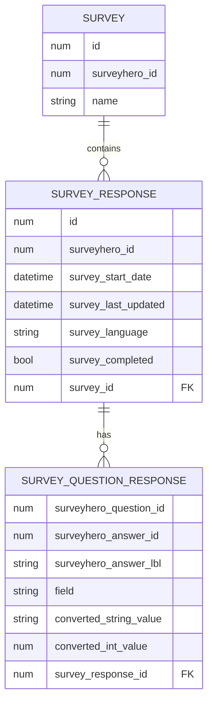

# Import Surveyhero responses into the Laravel database

[](https://packagist.org/packages/statikbe/laravel-surveyhero)
[](https://github.com/statikbe/laravel-surveyhero/actions?query=workflow%3Arun-tests+branch%3Amain)
[](https://github.com/statikbe/laravel-surveyhero/actions?query=workflow%3A"Fix+PHP+code+style+issues"+branch%3Amain)
[](https://packagist.org/packages/statikbe/laravel-surveyhero)

This package allows you to import [Surveyhero](https://www.surveyhero.com) survey responses. 

## Installation

You can install the package via composer:

```bash
composer require statikbe/laravel-surveyhero
```

You can publish and run the migrations with:

```bash
php artisan vendor:publish --tag="surveyhero-migrations"
php artisan migrate
```

You can publish the config file with:

```bash
php artisan vendor:publish --tag="surveyhero-config"
```

This is the contents of the published config file:

```php
return [
];
```

https://api.surveyhero.com/v1/surveys/53635/elements

## Usage

```php
$surveyhero = new Statikbe\Surveyhero();
echo $surveyhero->echoPhrase('Hello, Statikbe!');
```

## Data model



## Testing

```bash
composer test
```

## Changelog

Please see [CHANGELOG](CHANGELOG.md) for more information on what has changed recently.

## Contributing

You can post an issue and provide a pull request. Thanks!

## Credits

- [Sten Govaerts](https://github.com/statikbe)
- [All Contributors](../../contributors)

## License

The MIT License (MIT). Please see [License File](LICENSE.md) for more information.
